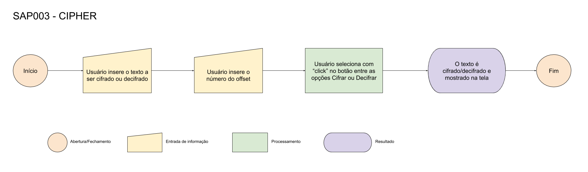

# Stay Safe

## Índice

* [1. Prefácio](#1-prefácio)
* [2. Resumo do projeto](#2-resumo-do-projeto)
* [3. Definição do Produto](#3-definição-do-produto)
* [4. Fluxograma](#4-fluxograma)
* [5. Usabilidade](#5-usabilidade)
* [6. Considerações Técnicas](#6-considerações-técnicas)

***

## 1. Prefácio

O projeto **Stay Safe** foi baseado na Cifra de César, uma técnica simples de criptografar uma mensagem, onde cada letra do alfabeto é substituida por outra de acordo com a escolha de deslocamento inserida pelo usuário.

Por exemplo, o usuário irá escrever seu texto e inserir um valor [n] de _offset_ (deslocamento), sendo:

**Resultado = (letra do texto + n)**

Assim, a palavra "Netflix" com um _offset_ de 3 posições, ficaria: "Qhwiola".

## 2. Resumo do projeto

A inspiração do tema foi a criatividade da minha irmã para definir suas senhas, onde geralmente escolhe sua senha de acesso como a do _netflix_, com o próprio nome netflix. Imagino que existam inúmeros usuários como ela, e, pensando nisso criei este site para ajudá-los a cifrar e decifrar, de forma simples o alfabeto e trazer uma maior segurança em seus dados.

## 3. Definição do produto

* **Como o produto poderá resolver o problema do usuário?**

Irá ajudar o usuário a ter uma senha mais forte, diminuindo as chances da conta ser hackeada ou a senha ser esquecida.

* **Quais são os objetivos do usuário em relação ao produto?**

Facilitar a memorização de uma senha fácil e transformá-la em uma senha difícil.

* **Quem são os principais usuários do produto?**

O produto foi pensado em todos os usuários que desejam aumentar a segurança de sua senha.

## 4. Fluxograma

## 5. Usabilidade

Através do site [StaySafe] você irá se deparar com uma página simples e intuitiva, onde deverá inserir o texto no campo "Text Here" e inserir o seu _offset_ abaixo dele, podendo ser um deslocamento positivo ou negativo. Após, escolha entre as opções "Encode" ou "Decode" e clique no botão referente, em seguida irá aparecer o seu texto criptografado no quadro "Cipher" ou "Decipher".

## 6. Considerações técnicas

O projeto foi implementado inteiramente em JavaScript(ES6).  